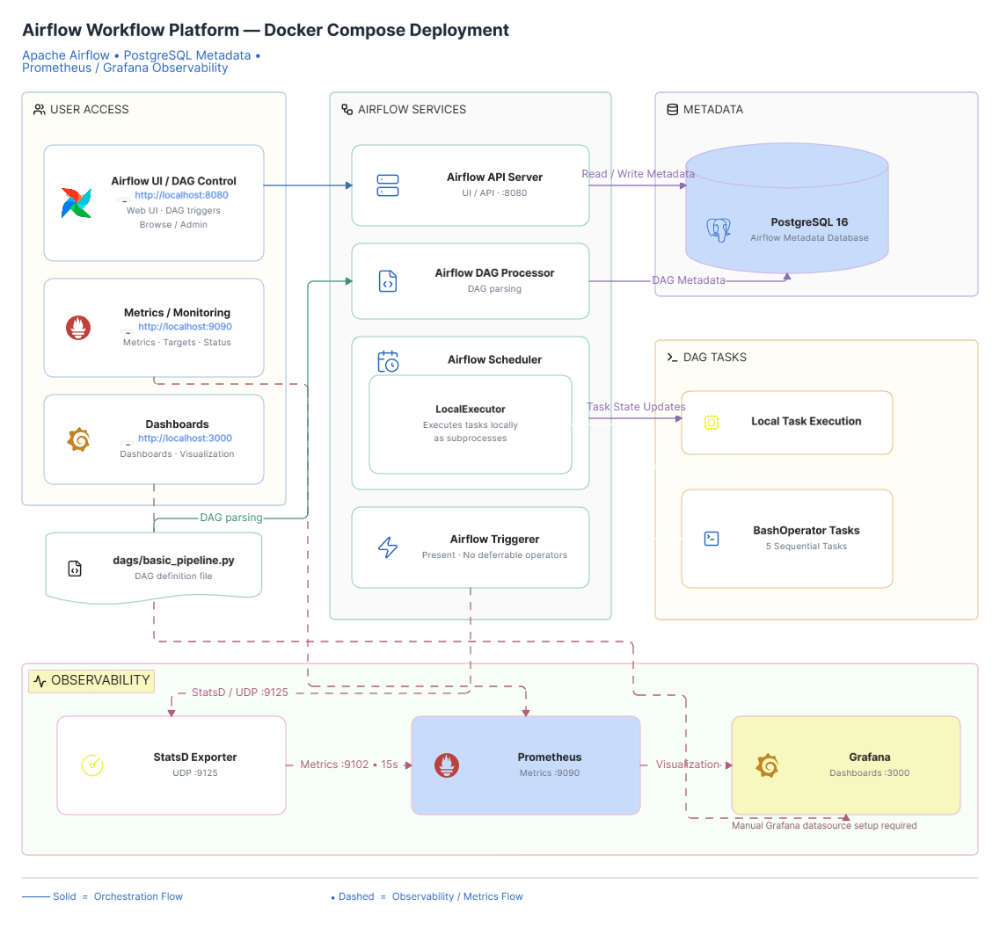
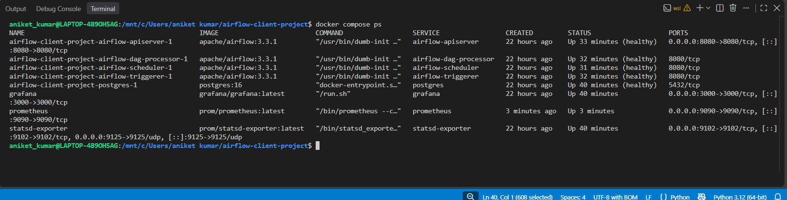
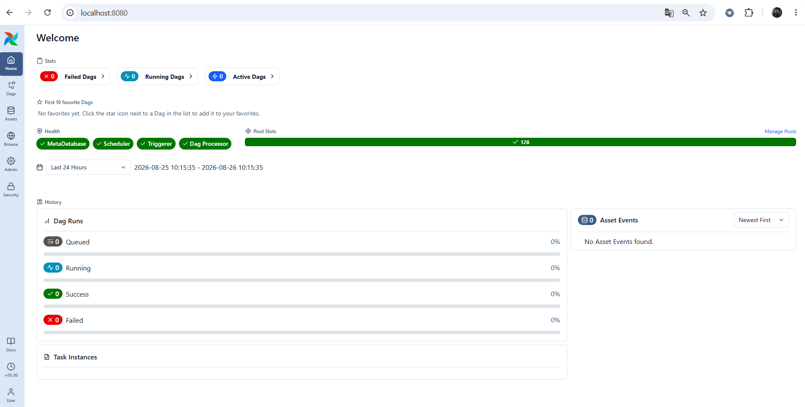
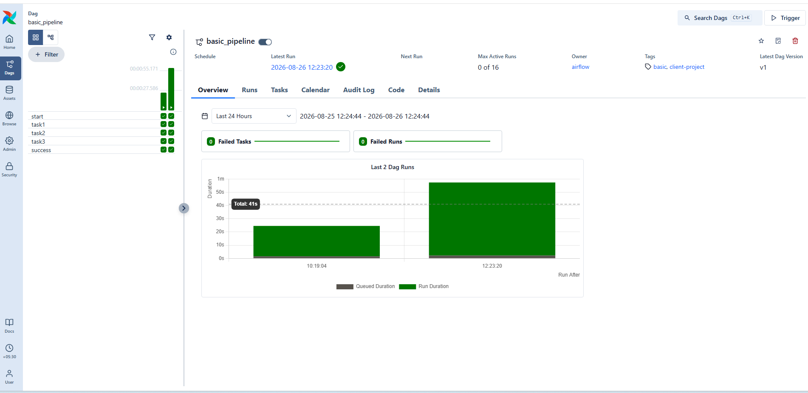
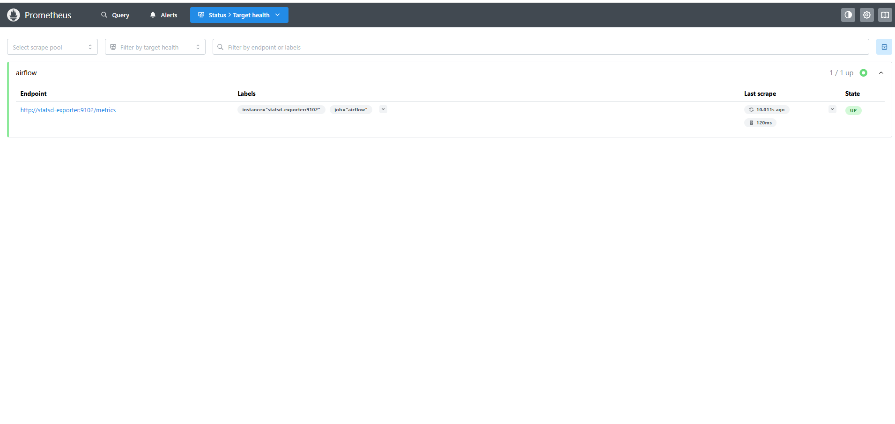
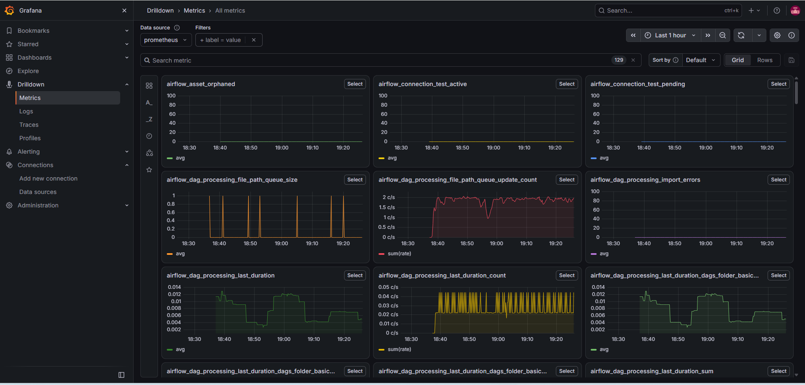
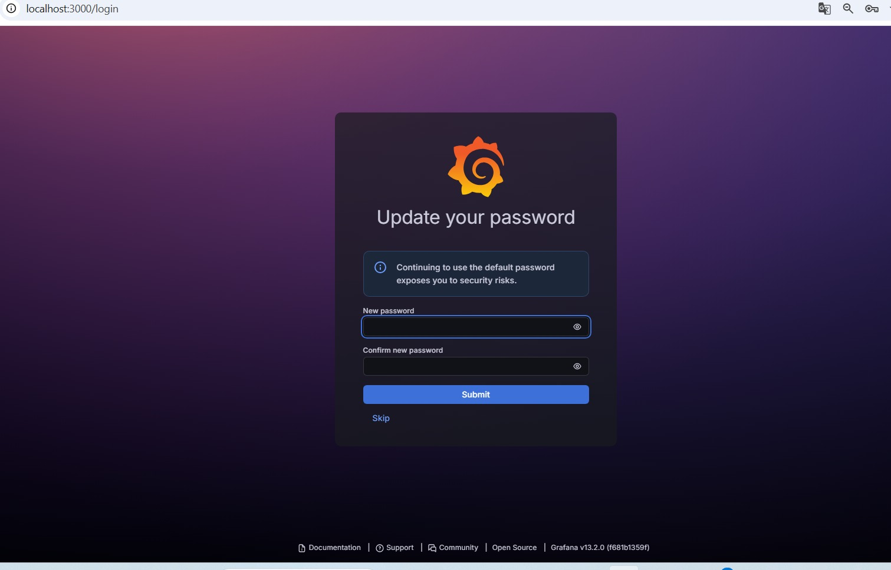

# Airflow + Docker Compose + Prometheus/Grafana Metrics Pipeline

A containerized Apache Airflow deployment — re-architected from the official CeleryExecutor/Redis reference template into a single-node **LocalExecutor + PostgreSQL** setup, instrumented end-to-end with a **StatsD → Prometheus → Grafana** metrics pipeline. Delivered as a freelance client project; fully orchestrated with a single `docker compose up`.



---

## Overview

This project takes Apache Airflow's official Docker Compose reference architecture and simplifies it for a single-node use case: the distributed CeleryExecutor + Redis worker model is replaced with **LocalExecutor**, removing unnecessary infrastructure while keeping every production-relevant pattern that actually matters at this scale — health checks, dependency ordering, persistent metadata storage, and non-root container execution.

On top of that, the stack is instrumented for observability: every Airflow component emits StatsD metrics, which are converted to Prometheus format and scraped on a 15-second interval, with Grafana wired in as the visualization layer.

**What this is:** a local/single-node Airflow deployment with a working metrics collection pipeline.
**What this isn't:** a distributed/production-scale platform, or a project with pre-built dashboards or alerting — see [Limitations](#limitations) for the honest scope.

---

## Architecture / Components

| Component | Role |
|---|---|
| **Airflow API Server** | Web UI + REST API for viewing and triggering DAGs (`:8080`) |
| **Airflow Scheduler** | Schedules DAG runs; executes tasks directly via **LocalExecutor** (no separate worker service) |
| **Airflow DAG Processor** | Parses DAG definition files independently of the scheduler |
| **Airflow Triggerer** | Handles deferrable operators — present in the stack, idle in this project since the current DAG uses none |
| **PostgreSQL 16** | Airflow's metadata database — DAG state, task instances, connections |
| **StatsD Exporter** | Receives StatsD metrics (UDP `:9125`) from Airflow, exposes them in Prometheus format (`:9102`) |
| **Prometheus** | Scrapes the StatsD Exporter every 15s (`:9090`) |
| **Grafana** | Visualization layer for Prometheus metrics (`:3000`) |

All components run as isolated services inside one Docker Compose network.

---

## End-to-End Workflow

```
User → Airflow API Server → DAG Processor (parses dags/basic_pipeline.py)
                           → Scheduler (schedules + executes via LocalExecutor)
                           → PostgreSQL (metadata read/write throughout)
```

The current DAG (`basic_pipeline.py`) runs 5 sequential `BashOperator` tasks (`start → task1 → task2 → task3 → success`) as local subprocesses inside the Scheduler container — there is no separate worker service, by design.

## Monitoring / Observability Flow

```
Airflow services (API Server, Scheduler, DAG Processor, Triggerer)
   → StatsD Exporter (UDP :9125)
   → Prometheus (scrapes :9102 every 15s)
   → Grafana (Prometheus added as a data source; no dashboards pre-provisioned)
```

---

## Technology Stack

Docker Compose · Apache Airflow 3.3.1 (LocalExecutor) · PostgreSQL 16 · Prometheus · Grafana · StatsD Exporter

---

## Repository Structure

```
.
├── dags/
│   └── basic_pipeline.py       # DAG: 5 sequential BashOperator tasks
├── prometheus/
│   └── prometheus.yml          # Single scrape job: statsd-exporter
├── docker-compose.yaml         # Full stack definition
├── .gitignore
└── README.md
```

---

## Prerequisites

- Docker + Docker Compose
- At least 4GB RAM allocated to Docker (Airflow's official image recommends this minimum)

---

## Setup Instructions

1. Clone the repository
   ```bash
   git clone https://github.com/aniket-devop/airflow-docker-grafana-monitoring.git
   cd airflow-docker-grafana-monitoring
   ```

2. Create a `.env` file in the project root with:
   ```
   AIRFLOW_UID=50000
   AIRFLOW_PROJ_DIR=.
   _AIRFLOW_WWW_USER_USERNAME=airflow
   _AIRFLOW_WWW_USER_PASSWORD=airflow
   FERNET_KEY=<generate with: python3 -c "from cryptography.fernet import Fernet; print(Fernet.generate_key().decode())">
   AIRFLOW__API_AUTH__JWT_SECRET=<generate your own random secret>
   GF_SECURITY_ADMIN_PASSWORD=<set your own Grafana admin password>
   ```
   > `FERNET_KEY` has no default and is required for Airflow to start. The JWT secret and Grafana password have insecure fallback defaults in the compose file — **always set your own** rather than relying on them, even locally.

3. Start the stack
   ```bash
   docker compose up -d
   ```
   The first run also performs DB migration and default-user creation via the `airflow-init` service — this runs once and exits.

---

## How to Access Each Service

| Service | URL | Default Login |
|---|---|---|
| Airflow UI | http://localhost:8080 | `airflow` / `airflow` (change via `.env`) |
| Prometheus | http://localhost:9090 | — |
| Grafana | http://localhost:3000 | `admin` / value of `GF_SECURITY_ADMIN_PASSWORD` |

---

## Configuration Notes

- `AIRFLOW__CORE__EXECUTOR=LocalExecutor` — the core architectural decision of this project; see [Key Engineering Decisions](#key-engineering-decisions)
- `AIRFLOW__METRICS__STATSD_ON=true` on every Airflow service, pointed at `statsd-exporter:9125`
- Postgres data persists in a named Docker volume (`postgres-db-volume`); Prometheus and Grafana do **not** have persistent volumes configured, so metrics history and any manual Grafana setup are lost if those containers are removed

---

## Testing / Validation

Verified locally with `docker compose ps` — all 8 services report `healthy` or `running`:



---

## Example Monitoring Results

**Airflow health check** — Metadatabase, Scheduler, Triggerer, and DAG Processor all reporting healthy:



**DAG execution** — `basic_pipeline` completing successfully across multiple runs, 0 failed tasks:



**Prometheus target health** — confirms the metrics pipeline is actually working end-to-end, not just configured:



**Grafana receiving live Airflow metrics** — via Grafana's built-in Explore/Metrics Drilldown view, showing 129 `airflow_*` metrics being queried through the Prometheus data source. *(Note: this is Grafana's ad-hoc query view, not a saved dashboard — no dashboard is pre-provisioned in this project; see Limitations.)*



---

## Key Engineering Decisions

**Why LocalExecutor instead of CeleryExecutor + Redis?**
The official Airflow Docker Compose template ships with CeleryExecutor and a Redis-backed worker queue by default — built for distributing task execution across multiple workers. For a single-node deployment, that adds a message broker and a separate worker fleet with no corresponding benefit. Swapping to LocalExecutor removes that complexity while keeping every other production-relevant pattern (health checks, service dependency ordering, persistent metadata storage) intact. This was a deliberate simplification, not an oversight.

**Why StatsD → Prometheus instead of scraping Airflow directly?**
Airflow doesn't expose a native Prometheus `/metrics` endpoint in this configuration, so the StatsD Exporter acts as the bridge: Airflow emits StatsD metrics natively, and the exporter republishes them in a format Prometheus can scrape — the standard pattern for this integration.

---

## Troubleshooting

| Issue | Cause | Fix |
|---|---|---|
| Airflow fails to start | `FERNET_KEY` not set in `.env` | Generate one (see Setup step 2) — there is no fallback default |
| `airflow-init` warns about low memory | Docker allocated less than 4GB RAM | Increase Docker's memory allocation in Docker Desktop settings |
| Grafana loads with no data | No datasource is auto-provisioned | Manually add Prometheus (`http://prometheus:9090`) as a data source in Grafana → Connections |
| Grafana prompts to change password on first login | Expected behavior — default admin credentials | Set a new password (see screenshot below) rather than skipping, especially outside local dev |



---

## Limitations

Being upfront about scope, deliberately:

- **No Grafana dashboards or datasource are pre-provisioned.** Prometheus is reachable and scraping correctly, but connecting it in Grafana and building dashboards is a manual step, not automated by this repository.
- **No alerting layer.** There is no Alertmanager, no Prometheus alert rules, and no Grafana alert rules — only container-level health checks and automatic restarts.
- **No persistent storage for Prometheus or Grafana.** Metrics history and any manual Grafana configuration are lost if those containers are removed.
- **Single-node only.** LocalExecutor does not scale horizontally; this is a deliberate trade-off for the project's scope, not a limitation to "fix."
- **Local development credentials.** Default Airflow/Grafana credentials are fine for local use but must be changed — via `.env` — before any non-local deployment.

## Future Improvements

- Provision a starter Grafana dashboard (JSON) and automatic Prometheus datasource config
- Add Alertmanager with basic failure-rate alert rules
- Pin third-party image versions (`prometheus`, `grafana`, `statsd-exporter` currently track `:latest`)
- Add persistent volumes for Prometheus and Grafana

---

## Skills Demonstrated

Docker Compose orchestration · Multi-service dependency management (health checks, `depends_on`) · Apache Airflow architecture (executor models, DAG authoring) · Metrics instrumentation (StatsD, Prometheus scrape configuration) · Observability tooling setup (Grafana/Prometheus integration) · Environment/secrets management via `.env`
